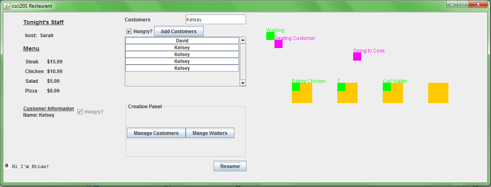

##Restaurant Project Repository

###Student Information
  + Name: Brian Chen
  + USC Email: brianych@usc.edu
  + USC ID: 8964066866
  
### Screenshot

### Description
Restaurant v2 is a Java based restaurant simulation including waiters, cooks, hosts, and customers using Eclipse. The program utilizes
Semaphores to handle multi-threaded actions.
  
###How to Run in Eclipse
  + Press the Play button at the top of Eclipse to Build and Run
  + Add new Customers with the new Customer Button.
  + You must input a name for the Customer before adding.
  + Add new Waiters with the new Waiter Button.
  + You must input a name for the Waiter before adding.
  
###Hacks to Run Scenarios
 + If you name your customer Chicken, Steak, Pizza, or Salad. He will ONLY order that item every single time. Please do not abuse.
If the item is already out, the customer will STILL try to order that item which will result in the customer sitting in the seat forever.
Remember this is a hack for grading easiness, not a functionality.
 + If you name your customer 0 or 5.99, the customer will have that set amount of money when he is created. $5.99 is the cheapest price on the menu. 

###Resources
  + [Restaurant v1](http://www-scf.usc.edu/~csci201/readings/restaurant-v1.html)
  + [Agent Roadmap](http://www-scf.usc.edu/~csci201/readings/agent-roadmap.html)
